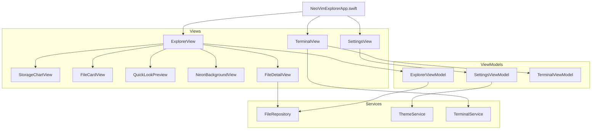

<table>
  <tr>   
    <td>
      
    </td>
    <td>
      <h1 style="color: #00bfa6;">NeoVimExplorer</h1>
      <p>Modularer Datei-Explorer im Stil von Neovim – modern, animiert & lokal.</p>
    </td>
  </tr>
</table>


**Datei-Explorer für iOS/macOS – mit Blur, Neon-Themes, CLI & Editor.**

---

## 

<div>
  
  
  
</div>

---

## 

- 🔍 Live-Datei-Explorer mit Grid-, Listen- & Kartenlayout  
- 🎨 Neon-Themes: TokyoNight, Gruvbox, Catppuccin  
- 📊 Interaktive Speicheranalyse mit Charts  
- ⚡️ Schnelle Fuzzy-Suche wie Telescope.nvim  
- ✏️ Integrierter Dateieditor für `.txt`, `.swift` etc.  
- 🖥 CLI-Terminal (ls, pwd, date, help) mit Verlauf  
- 🌈 Animierte Hintergrundbilder mit Blur & Glas-Effekt  
- 🧠 Favoritenverwaltung mit @AppStorage  
- 🔁 Reset aller Einstellungen  
- 🧩 MVVM + Repository Pattern + @Observable Swift 5.9

---

## 


## 

| Modul              | Technologie     | Funktion                                |
|--------------------|------------------|------------------------------------------|
| `ExplorerView`     | SwiftUI          | Dateiübersicht mit Karten und Charts     |
| `TerminalView`     | SwiftUI + Logic  | CLI mit Eingabe & Ausgabe (ls, help...)  |
| `FileDetailView`   | SwiftUI + IO     | Texteditor mit Schreibzugriff            |
| `SettingsView`     | SwiftUI + Slider | Layout, Theme, Favoriten, Reset          |
| `QuickLookPreview` | UIKit via Wrapper| Vorschau von PDF, Bild, Text-Dateien     |
| `NeonBackgroundView`| Blur + Image     | Wechselt Theme-basierte Hintergrundbilder|

---

## 

1. **Projekt klonen**
```bash
git clone https://github.com/NEO849/NeoVimExplorer.git
```

2. **Xcode-Projekt öffnen**
```bash
cd NeoVimExplorer && open NeoVimExplorer.xcodeproj
```

3. **App starten**
   - Schema `NeoVimExplorer` auswählen
   - `⌘R` drücken, los geht’s!

---

## 

| Technologie       | Einsatzbereich                  |
|-------------------|----------------------------------|
| Swift 5.10        | Typensichere Programmlogik       |
| SwiftUI 5.0       | UI, State, Animation             |
| Combine           | Reactive Pipeline (optional)     |
| QuickLook         | Dateivorschau                    |
| Swift Charts      | Speicherstatistik                |
| FileManager       | Lokaler Datei-Zugriff            |
| @AppStorage       | UserDefaults für Favoriten       |
| @Observable       | Neues SwiftUI MVVM (iOS 17+)     |

---

## 

- Dieses Projekt steht unter der CC0 1.0 Universal-Lizenz.  
- Siehe die [LICENSE](https://github.com/NEO849/NeoVimExplorer/blob/main/LICENSE) Datei.

---

## 

[](https://www.linkedin.com/in/michael-fleps-neo849/)  
[](https://github.com/MichaelFleps)

---

> „NeoVim trifft SwiftUI – für Entwickler, die Terminal-Liebe mit moderner UI kombinieren.“  
> – NeoVimExplorer Manifest
